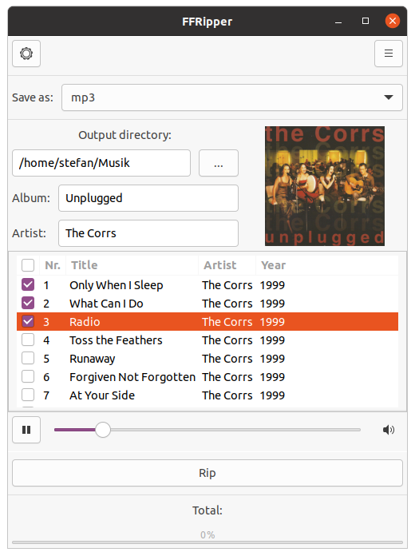
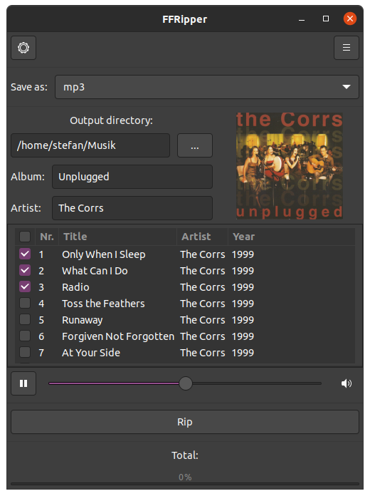

# FFRipper

A fast, powerful and simple to use Audio-CD ripper for Linux supporting 30+ output formats and tagging your CD automatically.

## In development...

FFRipper is in development right now.
